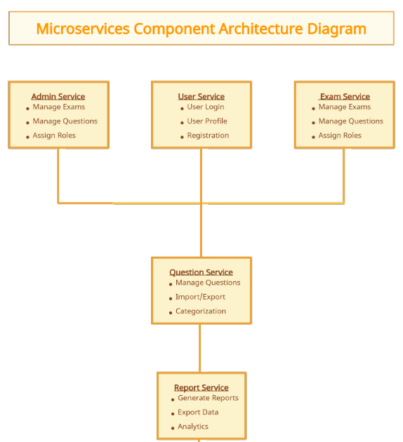

# Online Exam Portal - Question Module Documentation

## Table of Contents
- [Project Overview](#project-overview)
- [Architecture](#architecture)
  - [Backend](#backend)
  - [Layers](#layers)
- [Dependencies](#dependencies)
- [Database Tables](#database-tables)
  - [`questions`](#questions)
  - [`question_options`](#question_options)
- [REST API Endpoints](#rest-api-endpoints)
- [Security Configuration](#security-configuration)
- [Exception Handling](#exception-handling)
- [How to Run](#how-to-run)
- [Future Enhancements](#future-enhancements)
- [Contributors](#contributors)

## Project Overview

The **Online Exam Portal** is a web-based application designed to facilitate online exams. This module focuses on managing questions, including CRUD operations for questions, categorization, and difficulty levels. It is built using **Spring Boot** and integrates with a **MySQL database** for persistent storage.

---

## Architecture



### Backend
- **Framework**: Spring Boot
- **Database**: MySQL
- **Security**: Spring Security (currently configured to allow all requests without authentication)
- **REST API**: Exposes endpoints for managing questions.

### Layers

1. **Controller Layer**:
   - Handles HTTP requests and responses.
   - Maps endpoints to service methods.
   - Example: `QuestionController.java`.

2. **Service Layer**:
   - Contains business logic for managing questions.
   - Example: `QuestionService.java` and `QuestionServiceImpl.java`.

3. **Repository Layer**:
   - Interacts with the database using JPA.
   - Example: `QuestionRepository.java`.

4. **Model Layer**:
   - Represents the database entities.
   - Example: `Question.java`.

5. **Exception Handling**:
   - Custom exceptions and global exception handling.
   - Example: `ResourceNotFoundException.java` and `GlobalExceptionHandler.java`.

---

## Dependencies

### Required Dependencies
- **Spring Boot Starter Web**: For building REST APIs.
- **Spring Boot Starter Data JPA**: For database interaction using JPA.
- **MySQL Connector**: For connecting to the MySQL database.
- **Spring Boot Starter Security**: For security configurations.
- **Swagger (Springfox)**: For API documentation.
- **Jakarta Persistence API**: For JPA annotations.

---

## Database Tables

### `questions`
Stores question details.

| Column Name      | Data Type       | Description                     |
|------------------|-----------------|---------------------------------|
| `question_id`    | BIGINT (PK)     | Unique identifier for a question. |
| `text`           | VARCHAR         | The text of the question.       |
| `category`       | VARCHAR         | Category of the question.       |
| `difficulty`     | VARCHAR         | Difficulty level (e.g., Easy, Medium, Hard). |
| `correct_answer` | VARCHAR         | Correct answer for the question. |

### `question_options`
Stores options for each question.

| Column Name      | Data Type       | Description                     |
|------------------|-----------------|---------------------------------|
| `question_id`    | BIGINT (FK)     | Foreign key referencing `questions`. |
| `option_text`    | VARCHAR         | Text of the option.             |

---

## REST API Endpoints

### Question Management
1. **Create Question**
   - **Endpoint**: `POST /api/questions/create`
   - **Description**: Creates a new question.
   - **Request Body**:
     ```json
     {
       "text": "What is Java?",
       "category": "Programming",
       "difficulty": "Easy",
       "correctAnswer": "A programming language",
       "options": ["A programming language", "A coffee", "An island", "None of the above"]
     }
     ```

2. **Update Question**
   - **Endpoint**: `PUT /api/questions/{id}`
   - **Description**: Updates an existing question.
   - **Request Body**: Same as Create Question.

3. **Get Question by ID**
   - **Endpoint**: `GET /api/questions/{id}`
   - **Description**: Retrieves a question by its ID.

4. **Get All Questions**
   - **Endpoint**: `GET /api/questions`
   - **Description**: Retrieves all questions.

5. **Delete Question**
   - **Endpoint**: `DELETE /api/questions/{id}`
   - **Description**: Deletes a question by its ID.

---

## Security Configuration

The current security configuration (`SecurityConfig.java`) disables CSRF and permits all requests without authentication. This is suitable for development but should be updated for production.

---

## Exception Handling

### Custom Exception
- **ResourceNotFoundException**: Thrown when a requested resource (e.g., question) is not found.

### Global Exception Handler
- Handles exceptions globally and returns appropriate HTTP status codes.

---

## How to Run

1. **Database Setup**:
   - Create a MySQL database named `exam_portal`.
   - Update the credentials in `application.properties`.

2. **Run the Application**:
   - Use the command: `mvn spring-boot:run`.

3. **Access the Application**:
   - The backend runs on port `8090` by default.

---

## Future Enhancements

1. **Authentication and Authorization**:
   - Implement JWT-based authentication for secure access.

2. **Pagination**:
   - Add pagination for fetching questions.

3. **Search and Filters**:
   - Enable search by text, category, and difficulty.

4. **Frontend Integration**:
   - Develop a frontend to interact with the backend APIs.

---

## Contributors

- **Developer**: Sanidhya H R
- **Date**: June 17, 2025